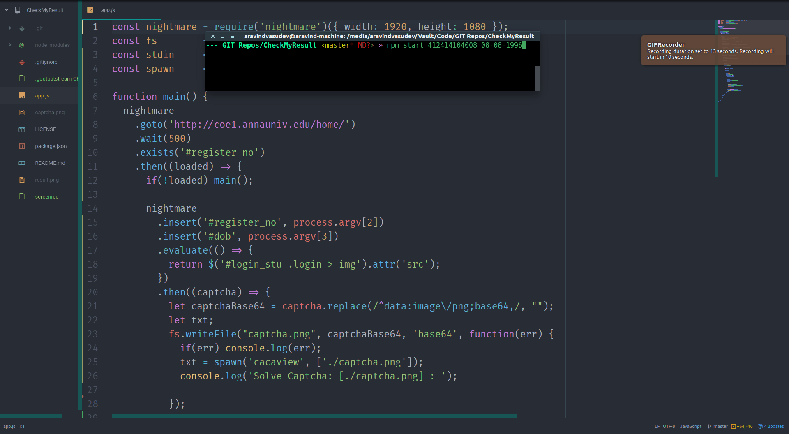

# CheckMyResult

> A simple helper script to check Anna University semester result under high traffic.

#### This project is moved to [https://github.com/AravindVasudev/CheckMyResult](https://github.com/AravindVasudev/CheckMyResult)

## What does this actually do?

Anna University servers are poorly maintained and when the results are released,
it does not respond properly to high traffic. Hence, students have to refresh the
page until it responds properly, reenter the register number, DOB, and captcha again
and again until they could navigate to 'Exam Results' tab without the page
crashing. This script automates that process and generates a screenshot of the
result page. All the user have to do is, solve the captcha until the website responds
properly.

## Dependencies
  * nightmare.js
  * cacaview (Linux ASCII image browser)

## Installation
  1. Clone this repository

  ```
    $ git clone https://github.com/AravindVasudev/CheckMyResult.git
    $ cd CheckMyResult
  ```

  2. Install cacaview

  ```
    $ sudo apt-get install caca-utils
  ```

  3. Install Dependencies

  ```
    $ npm install
  ```

  4. Start the Application

  ```
    $ npm start [register number] [DOB (DD-MM-YYYY)]
  ```

## FAQ

__Why doesn't this work on Windows?__

Unfortunately, since both the dependencies work better on Linux, I stuck with it. Sorry :grin:

__Why use cacaview?__

The captcha generated by the website is tiny and cacaview somehow displays the
image more clearly. If you don't want to use `cacaview`, replace `cacaview` in
line 31 with `display`.

__Captcha is hard to type this way. A UI would be good.__

Working on it! :smile:

__Can't you automate the captcha too?__

Unfortunately, the captcha is too small to be solved by an OCR. :pensive:

__Will this script work on other mirrors of Anna University server like http://coe2.annauniv.edu/ ?__

Since those mirrors are not open until the results are released, so haven't tested on them.


## Contribute

You are always welcome to open an issue or provide a pull-request!

## License

Built under [MIT](LICENSE) license.
